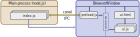

## Introduction

This boilerplate project offers a comfortable and safe starting point to use Electron in
TypeScript, while using as little dependencies as possible, but without compromising comfort 
and safety of development. Here is what makes it different:

The communication system between the main process and the UI process used by Electron
is an event mechanism  which allows you to pass complex structures in an asynchronous 
way in both directions. But for  safety reasons, the user interface process itself is
also divided into two distinct contexts:  

  

This separation is needed so that the code interpreted in the browser has never a direct access 
to the low level primitives of Node.js, otherwise the simple display of a page taken from an 
external site would be a major risk. But the result of this dual separation, if we follow the 
TypeScript integration solution [proposed in the Electron documentation](https://www.electronjs.org/docs/latest/tutorial/context-isolation#usage-with-typescript),
is a multiplication of declarations to define the distinct links in the communication chain. 
Moreover, this multiplication breaks the type validation chain at compile time, as each context 
is compiled separately. We are therefore going to propose a Yoctopuce solution which enables 
you to automatically generate these declarations during the build cycle, thus preserving the 
type validation chain from start to finish.

### What you will find in this project

To implement the secure link between the main process and the interface, we wrote a small 
automatic script which analyzes the TypeScript code of the main process and generates the 
three TypeScript source files required to implement the communication channel. These files 
are then respectively located in the main code, in the interface pre-loading code, and in 
the interface code itself. Type annotations are used from start to finish, which allows the 
editor and the compiler to validate the coherence of the complete chain, rather than causing 
execution error as it happened with the original solution proposed by Electron.  
  
To compile and to edit the links (_bundling_) we use [esbuild](https://esbuild.github.io/). 
It's the fastest tool of this kind, without any dependency, which advantageously replaces 
WebPack in the present case as it does exactly what we need.  
  
We designed two compilation and execution modes. The development mode generates, in the 
`debug/` directory, readable JavaScript code and .map files enabling you to debug in the 
TypeScript source code. In this mode, you run the locally installed Electron version, 
and the application automatically detects the changes that you make to the source files 
and recompiles them on the fly.  
  
The production mode generates _minified_ code and bundles it into 
`dist/resources/app.asar` file. You can then unzip
[Electron distributable binaries](https://github.com/electron/electron/releases) 
corresponding to your preferred architecture in the `dist/` directory, making sure that 
the version of the Electron libraries that you use corresponds, and you'll obtain an 
autonomous application which you can distribute as a zip or with an installer, as any 
other software.  
  
Last but not least, if you like to define your web interfaces as components with the 
JSX syntax, enabling you not only to integrate the TypeScript and HTML code, but also 
to validate the types up to the DOM attributes, this boilerplate is configured to 
integrate [preact](https://preactjs.com/), an ultra-light version of React. The example 
project shows its use on a typical example.

### Project structure

The project contains the following directories:
*   **build/:** Directory for our build tools (written in TypeScript)
*   **debug/:** Directory where we drop and run files compiled in development mode
*   **dist/:** Directory where we drop the files compiled in production mode, and where you only need to extract the [Electron distributable binaries](https://github.com/electron/electron/releases) to obtain an autonomous application
*   **src/:** Directory containing all the source files of the application
*   **src/Main/:** Directory specific to the main process
*   **src/UI/:** Directory specific to the user interface process

## Usage

We assume that you have already installed a recent version of Node.js on you machine. 
To use this project, start by copying the files on your machine and by installing 
the development dependencies:  

    npm install
  
To compile the development version, you can use:  

    npm run build-dev

But the most convenient is usually to compile and directly run the application in 
development mode, which includes reloading on the fly each time there is a modification 
in the source files, with the command:  

    npm run start-dev

To compile the production version, use:  

    npm run build-prod

When you have dropped the Electron distributable binaries in the dist/ directory, you 
can also combine compiling and running the production version with the command:  

    npm run start-prod
 
Note however that if you have renamed dist/electron\[.exe\] to give a more personalized 
name to the executable, you must change the line defining "start-prod" accordingly in 
the package.json file.  
  
Finally, if during development you only want to use the TypeScript code generator for 
communication between the processes, you can also run  

    npm run generate-api

for a one-time generation, or even  

    npm run watch-api

to launch a watcher which recompiles the interface each time there is a file change 
in the Main directory, so that the semantic check of the source codes in your editor 
happens in real time. Note that this function is embedded in the start-dev command, 
you therefore don't need to run it in parallel.  
  

### Role of each file

As the aim is not to give you a magic tool without explanation, here are details on 
the role of each source file of the project:

*   **src/dev-main.ts:** Entry point of the application in development mode, which launches as a background task a process detecting modifications in interface files to reload them on the fly before calling startApplication.
*   **src/prod-main.ts:** Entry point of the application in production mode, directly launching the startApplication application as soon as the Electron motor is ready.
*   **src/tsconfig.json:** TypeScript configuration of the application itself, containing the noEmit:true option so that the editor performs semantic checks but not the generation of JavaScript code as we do it with esbuild
*   **src/Main/main.ts:** Implements the startApplication method, which is going to
    *   include mainHandlers to set up the inter-process communication channel
    *   create a user interface process starting with `src/UI/preload.ts`
    *   open the interface window on `src/UI/App.html`
    *   run the background tasks defined in `src/Main/mainAPI.ts`
    *   stop the background tasks and exit when the interface is closed.
*   **src/Main/mainAPI.ts:** File implementing the mainAPI class, where you must put your code for the main task of your application and implement the methods which must be available for the user interface process. You can naturally import from there other modules which you would need to define your main process.
*   **src/Main/mainHandlers.ts:** Automatically generated file, which stores in the ipcMain object event handlers for methods which must be available to the user interface process.
*   **src/UI/App.css:** Stylesheet file of the user interface
*   **src/UI/App.html:** Root file of the user interface loaded by Electron, almost empty since all the interface of our example is defined in TypeScript/JSX. It is copied as-is in the execution directory of the application.
*   **src/UI/App.tsx:** Actual entry point of the user interface.  
    As we decided to create this example with [preact](https://preactjs.com/), the interface is defined as classes representing components that you can display, and the file ends with a call to the render() function which instantiates the root component in document.body. It is this file that you modify to build your user interface and in which you can import other components that you need. Naturally, if you don't want to use preact and the JSX syntax, you can replace the extension by .ts and put simple TypeScript code.
*   **src/UI/preload.ts:** Automatically generated file, used as entry point for the user interface process, before it is transferred to the browser. This file is the counterpart of mainHandlers.ts in the user interface process, with which it communicates through the ipcRenderer object. The functions that it defines are made available to the Electron contextBridge gateway.
*   **src/UI/preloadAPI.ts:** Automatically generated file, which can be included in user interface modules to access selected methods and functions of mainAPI with a typed interface.

To illustrate this, here is the resulting execution and communication flow chart:  

  
 
We must admit that this is quite a maze, but at least you know exactly the use of each file, 
and nothing is done behind your back :-)  

### How the generator works

Apart from the choice of minimalist tools, to which one is free to adhere or not, the main 
interest of this boilerplate is the small generator of TypeScript code which ensures 
communication between the main process and the user interface process. As indicated above, 
this generator creates:

*   the `mainHandlers.ts` file, imported by main.ts, which stores in the ipcMain object the event handlers required for calls from the user interface process to the main process.
*   the `src/UI/preload.ts` file, loaded when initializing the BrowserWindow in a privileged context to call the ipcRenderer methods, and to create the secure entry points using Electron contextBridge.
*   the `src/UI/preloadAPI.ts` file, which defines a typed interface that you can use from all the interface classes to access the functions exposed by the Electron contextBridge.

It's therefore an almost transparent replication for the developer of selected methods 
in mainAPI, which are exposed identically in the `preloadAPI` object of the user interface 
project.  
  
Naturally, the aim is not to expose all the methods of mainAPI, as some of them are not 
designed to be used by the user interface process and must be excluded, for security 
reasons. To select the methods which must be replicated, the generator uses the 
documentation of the functions. All the methods of the mainAPI object preceded by a 
comment of type 

    // Safe API: <function description>

are considered safe and made available 
to the user interface process, with the same prototype, in the `preloadAPI` object. The 
other methods are considered to be specific to the main process.  
  
A similar mechanism enables the main process to send structured data asynchronously to 
the use interface process(es). To do so, the `mainAPI` includes a send method which takes 
as argument an event name and one or several arguments to be sent. Following the same 
principle as for calls in the other direction, the generator retrieves in the whole 
code of `MainAPI` calls to the `mainAPI.send()` method, and creates the corresponding 
typed interface in `preloadAPI` so that one can subscribe to the reception of these 
message with a callback. For example, if your implement in the main process the 
following method:  
```ts
public log(msg: string): void  
{  
    this.logBuffer.push(msg);  
    if (this.logBuffer.length \> MAX\_LOG\_LINES) {  
        this.logBuffer.splice(0, 100); // Remove 100 oldest lines  
    }  
    // Safe API: Advertise new log messages  
    mainAPI.send('log', msg);  
}
```
  
then the generator adds to the `preloadAPI` interface the following declarations:  
```ts
export type LogCallback = (msg: string) => void;  
...  
export interface PreloadAPI {  
        ...  
    //  Advertise new log messages  
    registerLogCallback(logCallback: LogCallback): UnsubscribeFn  
        ...  
}
```
Note that the logCallback identifier is directly derived from the message name which 
was used with the `mainAPI.send` method. Likewise, the parameter type(s) of the callback 
function are determined by the type of the arguments passed as parameters to 
`mainAPI.send`.  
  
Obviously, in a real life project, you need to structure your main process with 
several classes covering different features. The generator can reflect that in the 
`preloadAPI` interface as well, on the basis of marking with `Safe API:` comments 
on the properties susceptible to contain interfaces that need to be replicated. 
For example, if you define your `MainAPI` class as follows:  
```ts
export class MainAPI  
{  
    // Safe API: Access to Yoctopuce device monitoring  
    public yoctoMonitor: YoctoMonitor;  
    // Safe API: Access to specific database functions  
    public dbAccess: DBAccessor;  
    // Safe API: Access to system logs  
    public logging: Logging;  
  
    constructor()  
    {  
        // Instantiate background tasks and helpers  
        this.logging = new Logging();  
        this.yoctoMonitor = new YoctoMonitor(\['127.0.0.1'\]);  
        this.dbAccess = new DBAccessor();  
    }  
    ...  
}
```
and that `YoctoMonitor`, `DBAccessor`, and `Logging` classes themselves declare 
`Safe API:` methods, you find them in the interface on the other side in the
following shape:  
```ts
export interface PreloadAPI {  
    //  Access to Yoctopuce device monitoring  
    yoctoMonitor: {  
        //  Get an array of connected devices  
        getConnectedDevices(): Promise<string\[\]\>  
    },  
  
    //  Access to specific database functions  
    dbAccess: {  
        ...  
    },  
  
    //  Access to system logs  
    logging: {  
        ...  
    },  
    ...  
}
```
which again enables you to use the user interface process transparently, identically 
to what you would have done in the main process.  
